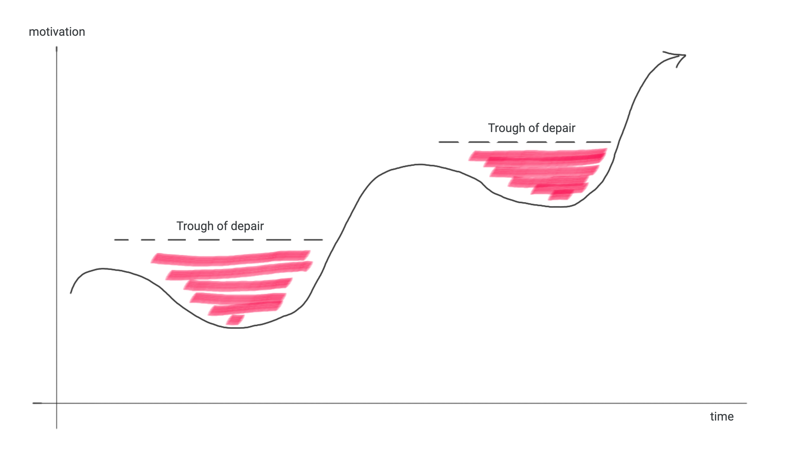
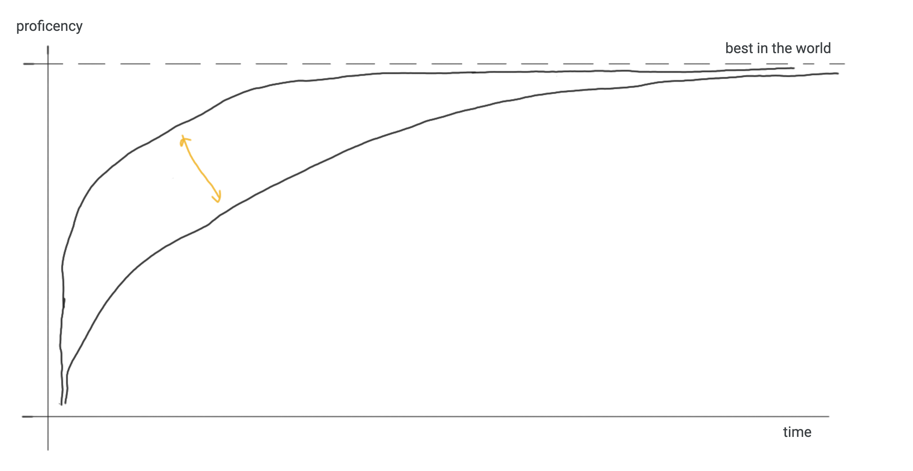

# What are the qualities of an intelligent person?

I've had a few interesting conversations with some friends recently about what separates intelligent people from
average or un-intelligent people. I'd love to open up the conversation and hear how others think about intelligence.
This is intentionally a subjective take on "intelligence" and not definitive, objective or measurable.

### Qualities of intelligent people

They're disciplined.

They recognize that mastery of anything requires dedicated and consistent effort, and consciously set aside time on a
regular basis to make growth and their goals possible.
 

They're intrinsically motivated.

For example, to the casual bystander it's usually not possible to tell the difference between someone in the 5th or 1st 
percentile of a certain domain - meaning that external recognition has diminishing returns. So even though an 
intelligent person might enjoy sharing their goals and milestones with friends and others, intrinsic motivation is 
necessary to push yourself through trough(s) of despair. 
 
 

 
 

They're capable of independent thought

With enough hand-holding, motivation and discipline, even the average can reach impressive milestones in due time. But
those who are able to form new thoughts/(re)discover new ideas on their own tend to progress, learn and master faster.
 
 

 

### Possible manifestations

- Can push conversations forward in interesting ways, discuss abstract topics
- Can do pretty much anything to an above-average level
- Does impressive things, especially as perceived by others with some mastery in the same domain

### Possible anti-manifestations

Someone who is up-to-date on all the latest news but really just the headlines

Just considering many people are collectivized to make it as easy for you to stay up to date on the new, it seems like a
given that discipline and motivation aren't needed. Additionally, if you can't ever create and/or infer new information
on the topic (i.e. just rattle off the headlines), you're not really adding anything to the conversation, you're not 
having independent thoughts.
 

People who reach impressive milestones in an average amount of time

My thinking here is that with enough discipline and motivation, anyone can achieve impressive things (like playing
the violin really well or solving a Rubik's Cube in under 10 seconds), but in order to reach these milestones in
impressive amounts of time you'll need independent thought
 

Someone who is quick to form opinions without being open to changing them

It seems like the natural tendency for most people is to quickly form an opinion, so it follows that taking things
slow and challenging yourself take discipline and motivation. Of course, if you can't form "new" thoughts on your
own, it's hard to imagine being able to challenge your existing ones as well.
 

